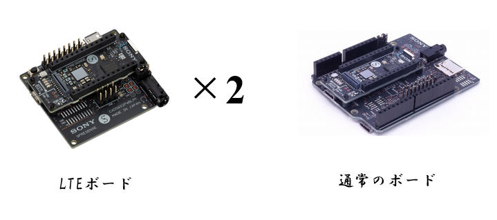
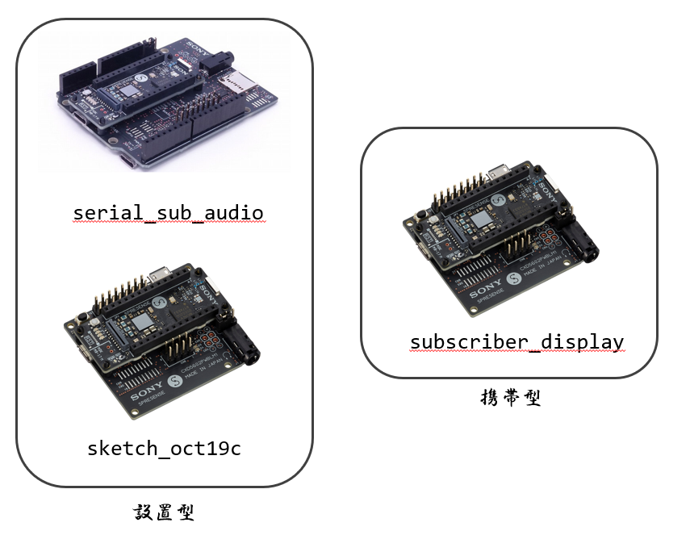
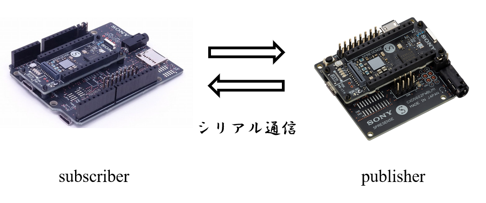
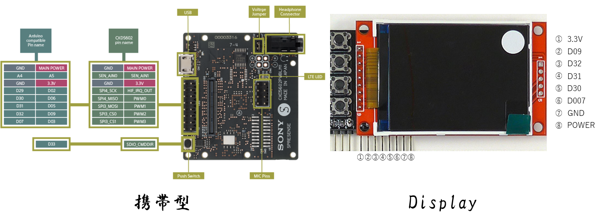
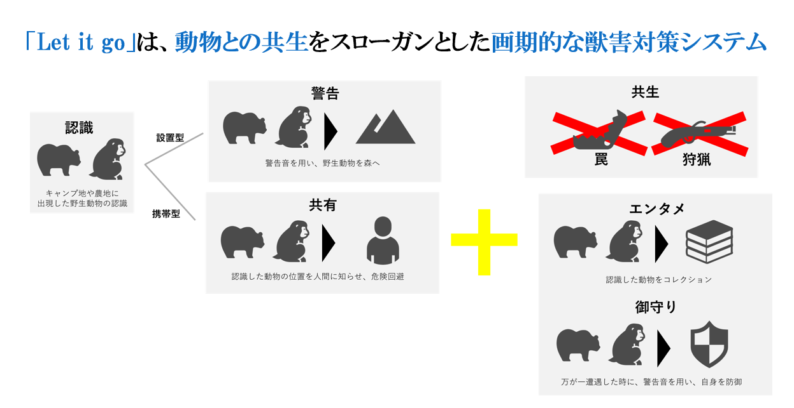

# let it go

## 製品について
本製品は、携帯型デバイスと設置型デバイスを用いて動物の共生を図ります。  
動物の検出にはAIを用いているので、事前に学習をする必要があります。

## 使用方法

1. spresenseを3つ用意  
    3つのうち2つはLTE拡張ボード、1つは普通の拡張ボードにしてください

      

2. パソコンにarduino ideをインストール  
    バージョンはなんでもいいです

3. 書き込み  
    LTE拡張ボードの方にsubscriber_display、sketch_oct19c  
    普通の拡張ボードにserial_sub_audioを書き込んでください
      

4. シリアル通信  
    sketch_oct19cとserial_sub_audioを書き込んだspresenseはシリアル通信を行います  
    そのため、serial_sub_audioがsubscriberになるように配線してください
      

5. ディスプレイ  
    subscriber_displayはディスプレイと接続します  
      

6. カメラ
    設置型のLTE拡張ボードにカメラをつなげてください

7. スピーカー
    携帯型と設置型にスピーカーをつなげてください

8. その他
    メモリカードとチップを差し込んでください

9. 起動
    全てに電源をつなげれば自動的に開始されます

## 機能
本製品の機能は以下の通りです  
*  AIを用いた動物検出
*  LTE通信を用いて動物の検出を共有
*  スピーカーを用いて動物を遠ざける

## システムモデル
  
